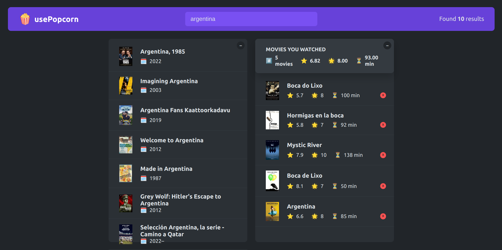

# Pop Corn Movies

## Table of Contents
- [Overview](#overview)
- [Built With](#built-with)
- [Features](#features)
- [Acknowledgements](#acknowledgements)

## Overview
- Simple app which allows to look for an specific movie.
- We built the application front-end and use a third API movie (https://www.omdbapi.com/) where to fetch the data from.
- It was built with React using Create React App.
- You can try it out at [Vercel - Pop Corn Movies](https://pop-corn-movies.vercel.app/)

### Built With
- Composition
- Reusability
- Layouts
- useEffect
- Data fetching
- Custom hooks

## Features
- Very simple application, where users can seach for any kind of movies from a seach bar in the main menu.
- Users can rate a movie.
- Users can add movies a the user's watched list.
- The watched list has some statistic about the movies such as total number of movies, average movies rate and average duration.
- Movies can be removed from the wathced list.
- Found movies and watched movies panels can be collapsed. 

## Acknowledgements
This project is part of The Ultimate React Course 2023: React, Redux & More by [Jonas Schmedtmann](http://jonas.io/).